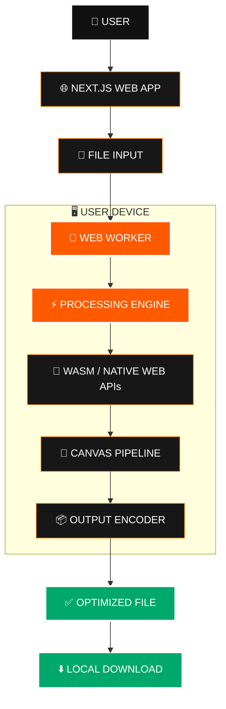
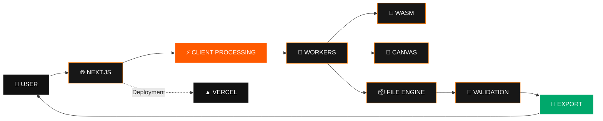

<div align="center">


# ⚡ KBFixer

### **Ultra-Fast, 100% In-Browser File & Image Size Optimizer**

<br/>

[](https://kbfixer.onepersonai.in)
[](https://onepersonai.in)
[](LICENSE)
[](https://nextjs.org/)

<br/>


<br/>

> **Compress smarter. Resize precisely. Keep your files local.**

<p>
<a href="#-why-kbfixer">Why KBFixer</a> •
<a href="#-how-it-works">How It Works</a> •
<a href="#-core-features">Features</a> •
<a href="#-architecture">Architecture</a> •
<a href="#-getting-started">Getting Started</a>
</p>

</div>

---

# 🧬 What is KBFixer?

**KBFixer** is a privacy-first, browser-native file optimization utility built under the **OnePersonAI** ecosystem.

It is designed for situations where a file isn't necessarily too large to exist — it is simply **too large for the form, portal, upload field, or workflow you're trying to use it with.**

Instead of making users upload personal documents to a remote compression service, KBFixer is designed around **local browser-side processing**.

### The simple idea:

```text
             YOUR FILE
                 │
                 ▼
        ┌─────────────────┐
        │    KBFIXER      │
        │   IN YOUR WEB   │
        │    BROWSER      │
        └────────┬────────┘
                 │
          LOCAL PROCESSING
                 │
        ┌────────┴────────┐
        │                 │
        ▼                 ▼
    COMPRESS            RESIZE
        │                 │
        └────────┬────────┘
                 ▼
          OPTIMIZED FILE
                 │
                 ▼
              DOWNLOAD
```

**No unnecessary upload → no unnecessary round trip → no waiting for a remote server to process your file.**

---

# 🔐 Why KBFixer?

Traditional online compression workflows often look like this:

```text
FILE
 │
 ▼
UPLOAD ───────────────► CLOUD SERVER
                              │
                              ▼
                         PROCESSING
                              │
                              ▼
DOWNLOAD ◄────────────── RESULT
```

KBFixer is built around a different model:

```text
FILE
 │
 ▼
┌───────────────────────────────┐
│        YOUR BROWSER           │
│                               │
│   Decode → Process → Encode   │
│                               │
└───────────────┬───────────────┘
                │
                ▼
             RESULT
```

### 🔒 Privacy by Architecture

When processing is performed locally, sensitive files don't need to be sent to a third-party image-processing server just to perform a basic optimization task.

This is especially valuable for workflows involving:

- 🪪 Identity documents
- 📸 Personal photographs
- ✍️ Signatures
- 👍 Thumb impressions
- 📄 Academic documents
- 🧾 Application forms
- 🏛️ Government submissions

> **Your browser becomes the processing environment.**

---

# ⚡ How It Works


### The processing philosophy

**Input → Understand → Optimize → Validate → Export**

The goal isn't simply to make a file smaller.

The goal is to make it **usable at the destination.**

---

# 🎯 Built Around Real Upload Problems

A common problem with online forms isn't:

> "Can I upload an image?"

It's:

> **"Why is this image 127 KB when the form only accepts 50 KB?"**

KBFixer is designed for exactly these practical constraints.

```text
┌─────────────────────────────────────────────────────┐
│                 UPLOAD REQUIREMENT                  │
├─────────────────────────────────────────────────────┤
│                                                     │
│   Maximum Size        →        Target Size          │
│   Required Format     →        Output Format        │
│   Required Dimensions →        Target Dimensions    │
│                                                     │
└──────────────────────────┬──────────────────────────┘
                           │
                           ▼
                    ┌──────────────┐
                    │   KBFIXER    │
                    └──────┬───────┘
                           │
                           ▼
                 ┌──────────────────┐
                 │ READY TO SUBMIT  │
                 └──────────────────┘
```

> Always verify the latest requirements of the specific portal before submitting a file.

---

# 🔥 Core Features

## 📸 Image Optimization

Designed for practical image workflows involving:

- JPEG
- PNG
- WEBP
- AVIF

Control the important variables:

```text
IMAGE
 │
 ├── SIZE
 │
 ├── DIMENSIONS
 │
 ├── FORMAT
 │
 └── QUALITY
       │
       ▼
   OPTIMIZED OUTPUT
```

---

## 📄 PDF & Document Workflows

KBFixer also targets common document-upload workflows where users need to prepare files for online submissions.

Useful scenarios include:

- Application portals
- Academic submissions
- Document uploads
- Online forms
- File-size constrained workflows

---

# 🧠 Client-Side Processing Architecture



---

# 🧵 Why Web Workers?

Image processing can be computationally expensive.

Instead of making every operation compete directly with the interface, KBFixer can move heavy work into background execution where appropriate.

```text
                 MAIN THREAD
              ┌───────────────┐
              │ UI / PREVIEW  │
              └───────┬───────┘
                      │
                      │
              ┌───────▼───────┐
              │  WEB WORKER   │
              │               │
              │ PROCESS FILE  │
              │     ↓         │
              │ OPTIMIZE      │
              │     ↓         │
              │ ENCODE        │
              └───────┬───────┘
                      │
                      ▼
                   RESULT
```

### Result

**UI stays responsive while processing happens separately.**

---

# 🏗️ Full System Architecture



---

# 🎨 PRODUCT DESIGN

KBFixer follows a **Neo-Brutalist Black & White interface** with orange as the system accent.

```text
┌────────────────────────────────────────────────────────┐
│                                                        │
│                    K B F I X E R                       │
│                                                        │
│       DROP YOUR FILE • SET TARGET • EXPORT             │
│                                                        │
│   ┌──────────────────────────────────────────────┐     │
│   │                                              │     │
│   │              DROP FILE HERE                  │     │
│   │                                              │     │
│   │        JPG • PNG • WEBP • PDF                │     │
│   │                                              │     │
│   └──────────────────────────────────────────────┘     │
│                                                        │
│            [ COMPRESS ]  [ RESIZE ]                    │
│                                                        │
└────────────────────────────────────────────────────────┘
```

The design intentionally keeps the interface:

- High contrast
- Minimal
- Fast to understand
- Keyboard-friendly
- Mobile-conscious
- Focused on the actual task

---

# 🧰 Technology Stack

| Layer | Technology |
|:---|:---|
| Framework | Next.js 16 |
| Application | React |
| Language | TypeScript |
| Styling | Tailwind CSS |
| Processing | WebAssembly / Browser APIs |
| Parallel Execution | Web Workers |
| Image Processing | Canvas APIs |
| Icons | Lucide React |
| Deployment | Vercel |
| Analytics | Vercel Analytics |
| SEO | Schema.org / JSON-LD |

---

# 🗂️ Project Architecture

```text
kbfixer/
│
├── app/
│   ├── page.tsx
│   ├── layout.tsx
│   └── ...
│
├── components/
│   └── ...
│
├── lib/
│   └── ...
│
├── public/
│   └── ...
│
├── package.json
├── package-lock.json
├── next.config.*
├── tsconfig.json
├── tailwind.config.*
└── README.md
```

---

# 📊 Feature Matrix

| Capability | KBFixer |
|:---|:---:|
| Browser-based workflow | ✅ |
| Client-side processing | ✅ |
| Image optimization | ✅ |
| Image resizing | ✅ |
| Multiple image formats | ✅ |
| PDF workflow | ✅ |
| Document workflow | ✅ |
| Web Worker architecture | ✅ |
| WASM-ready processing | ✅ |
| Mobile-friendly UI | ✅ |
| Exam / form workflows | ✅ |
| Privacy-first architecture | ✅ |
| Modern Next.js stack | ✅ |
| SEO / structured data | ✅ |

---

# 🧭 THE KBFIXER PIPELINE


### One workflow.

**Six simple stages.**

No complicated software required.

---

# 🚀 Getting Started

## Prerequisites

Make sure you have:

- Node.js 18+
- npm / yarn
- Git

## Installation

```bash
git clone https://github.com/AkshatRaj00/kbfixer.git

cd kbfixer

npm install
```

## Start Development Server

```bash
npm run dev
```

Open:

```text
http://localhost:3000
```

---

# 🧪 Production Build

```bash
npm run build
```

Then:

```bash
npm start
```

---

# 🌐 OnePersonAI Ecosystem

KBFixer is part of the broader **OnePersonAI** ecosystem — a collection of practical AI-powered and developer-focused tools.

```text
                         ONEPERSONAI
                              │
              ┌───────────────┼───────────────┐
              │               │               │
              ▼               ▼               ▼
          KBFIXER        CUTOUT STUDIO     FUTURE TOOLS
              │               │               │
              ▼               ▼               ▼
        FILE OPTIMIZATION  IMAGE MATting   AI UTILITIES
```

### Ecosystem

**Main Platform**

https://onepersonai.in

**KBFixer**

https://kbfixer.onepersonai.in

**CUTOUT Studio**

https://cutout.onepersonai.in

---

# 📢 Official Community

Stay connected with OnePersonAI for:

- Product launches
- Engineering updates
- Open-source releases
- New utilities
- AI experiments
- Developer content

| Platform | Official |
|:---|:---|
| 📢 Telegram | @onepersonaiofficial |
| 🎥 YouTube | @OnePersonAI_Official |
| 𝕏 X / Twitter | @onepersonai_in |
| 📸 Instagram | @onepersonaiofficial |
| 💼 LinkedIn | OnePersonAI |
| 📘 Facebook | OnePersonAI |

---

# 🛡️ Privacy Philosophy

KBFixer is built around a simple principle:

> **A file doesn't need to leave your device just because you need to make it smaller.**

The browser has become capable of performing increasingly sophisticated computation locally.

KBFixer takes advantage of that direction to build a more privacy-conscious file-processing experience.

```text
             LESS UPLOAD
                  ↓
             LESS EXPOSURE
                  ↓
             LOCAL COMPUTATION
                  ↓
             FASTER WORKFLOW
                  ↓
             BETTER CONTROL
```

---

# 🤝 Contributing

Contributions, bug reports, feature ideas, and improvements are welcome.

Before opening a pull request:

```bash
npm run lint
npm run build
```

Please keep contributions focused, maintainable, and consistent with the project's privacy-first philosophy.

---

# 📜 License

KBFixer is distributed under the **MIT License**.

See [`LICENSE`](LICENSE) for the complete license text.

---

<div align="center">


### ⚡ KBFixer

**Compress. Resize. Optimize.**

**Your files. Your browser. Your control.**

<br/>

`ONEPERSONAI © AKSHAT RAJ`

</div>
